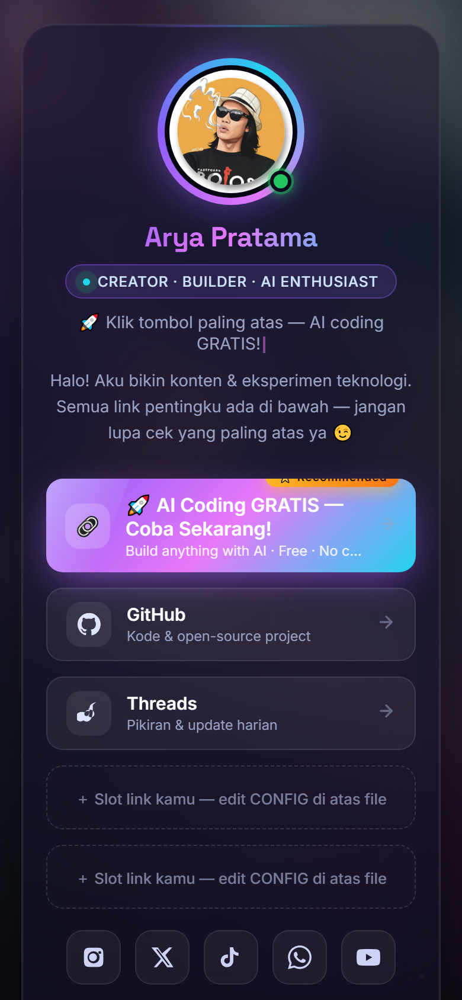
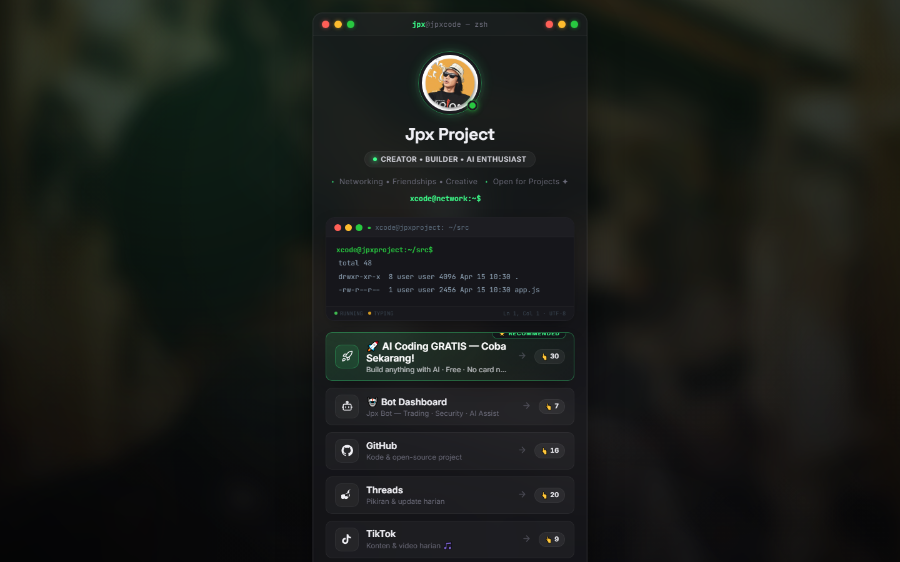
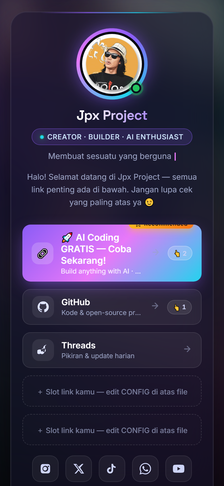
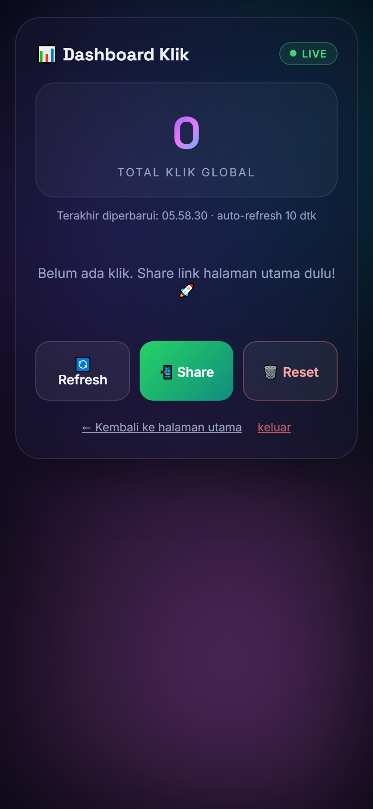

<div align="center">

# 📱 Ultra-Mobile Profile & Bio Link Landing Page
### Template Profile Link Tree Modern & Analytics Dashboard (2026 Edition)

[](https://developer.mozilla.org/en-US/docs/Web/HTML)
[](https://developer.mozilla.org/en-US/docs/Web/CSS)
[](https://developer.mozilla.org/en-US/docs/Web/JavaScript)
[](https://workers.cloudflare.com/)
[](#-desain-mobile-first-ultra-responsif)

<br />

**Satu Halaman Profile Bio Link yang Super Fast, Aesthetic, dan Dioptimalkan Khusus untuk Device Smartphone.**

*Inspirasi sempurna untuk developer, content creator, dan profesional yang ingin menampilkan portfolio & semua link sosial media mereka dalam tampilan kelas atas.*

</div>

---

## 🌟 Mengapa Memilih Template Ini?

Sebagian besar visitor dan follower sosial media mengakses link bio Anda melalui **perangkat smartphone**. Template ini dirancang dari awal (*Mobile-First*) untuk memberikan impresi pertama yang **memukau, responsif, dan ultra-smooth**.

- 🎨 **Modern Glassmorphism & Aurora Mesh**: Kombinasi warna futuristik, efek glassmorphism, dan dukungan background photo blur otomatis.
- ⚡ **Zero Framework Overhead**: Dibangun murni dengan HTML, CSS Vanilla, dan Plain JS — load dalam hitungan milidetik tanpa dependency berat.
- 📊 **Real-time Global Click Counter**: Terhubung dengan Cloudflare Worker & KV Store untuk menghitung total klik tombol secara real-time.
- 📈 **Analytics Dashboard Included**: Dilengkapi halaman dashboard bawaan ([dashboard.html](file:///C:/Users/XCODE/myPage/dashboard.html)) untuk memantau performa klik.
- ⚙️ **Konfigurasi Super Mudah**: Cukup edit objek `CONFIG` pada satu file tanpa perlu *compile* atau *build step*.

---

## 📸 Showcase & Preview Fitur

### 📱 Tampilan Smartphone (Mobile-First Optimization)
Desain diukur presisi untuk kenyamanan jempol (*thumb-zone*), mendukung *iOS/Android safe-area-inset*, serta micro-animation saat disentuh.



---

### 🖥️ Tampilan Desktop & Tablet
Tampilan otomatis beradaptasi dengan sempurna pada layar lebar tanpa kehilangan impresi visualnya.



---

### 📊 Real-Time Analytics Dashboard & Live Status
Pantau total klik per link dan status ketersediaan Anda secara langsung (*Online / Open for Projects*).

| Live Online Status | Analytics Dashboard |
| :---: | :---: |
|  |  |

---

### 🎬 Preview Animasi & Fitur (GIF Showcase)

> 💡 *Sertakan file `.gif` pada direktori proyek untuk menampilkan animasi langsung pada README.*

```carousel

<!-- slide -->

<!-- slide -->

```

*(Catatan: Anda dapat merekam GIF singkat layar smartphone Anda dan menyimpannya sebagai `demo.gif` di folder utama).*

---

## 🚀 Fitur Utamanya (Key Features)

1. **Mobile-First UX Optimization**
   - Mendukung rasio layar smartphone modern (termasuk Notch & Dynamic Island).
   - Layout responsif & fluid typography.

2. **Typing Tagline Effect**
   - Fitur teks berjalan (*typewriter effect*) di bawah nama profil untuk menampilkan perkenalan dinamis.

3. **Multi-Source Avatar & Background Fallback**
   - Otomatis menggunakan foto profil lokal `avatar.jpg` / `bg.jpg` dan beralih ke gradien aurora mesh jika foto tidak ditemukan.

4. **Global Click Counter & Optimistic UI**
   - Penghitung klik lokal super cepat dengan ekosistem sinkronisasi backend ke Cloudflare Worker.

5. **Cloudflare Worker Analytics Backend**
   - Terintegrasi dengan script backend di folder [`worker/`](file:///C:/Users/XCODE/myPage/worker/) yang ringan dan gratis disebarkan ke Cloudflare.

---

## ⚙️ Cara Penggunaan & Kustomisasi Mudah

Anda tidak memerlukan Node.js atau bundler untuk mengubah isi profile ini.

1. Buka file [`index.html`](file:///C:/Users/XCODE/myPage/index.html).
2. Cari bagian **`CONFIG`** pada tag `<script>` (di bagian bawah file):

```javascript
const CONFIG = {
  title: "Jpx Project · Semua Link",
  name: "Jpx Project",
  role: "Software Engineer & Creator",
  bio: "Membangun aplikasi modern, AI tools, dan solusi web performa tinggi.",
  taglines: [
    "🚀 Mobile-First Web Developer",
    "⚡ Cloudflare & Edge Enthusiast",
    "💻 AI Driven Solutions"
  ],
  links: [
    {
      title: "Freebuff AI Coding",
      sub: "Akses AI Coding Gratis Tanpa Batas",
      url: "https://example.com/freebuff",
      icon: "code",
      featured: true,
      badge: "HOT"
    },
    // Tambahkan link lainnya di sini...
  ],
  socials: [
    { icon: "github", url: "https://github.com/jpXproject" },
    { icon: "threads", url: "https://threads.net" }
  ],
  clicksApi: "https://worker-anda.workers.dev" // URL Cloudflare Worker Anda
};
```

3. Simpan file `index.html` dan buka langsung di browser atau tempatkan di hosting statis!

---

## 🛠️ Struktur Proyek (Directory Architecture)

```
my-profile-page/
├── index.html            # Halaman utama landing page profile
├── dashboard.html        # Halaman dashboard analytics & statistik klik
├── og-image.png          # Gambar preview untuk sosial media (Open Graph)
├── shot_mobile.png       # Screenshot tampilan mobile
├── shot_desktop.png      # Screenshot tampilan desktop
├── shot_dashboard.png    # Screenshot halaman dashboard
├── shot_live_online.png  # Screenshot fitur live status
├── verify_profile.js     # Script verifikasi elemen UI
├── dist/                 # Asset produksi & gambar bawaan (avatar.jpg, bg.jpg)
├── image/                # Asset gambar tambahan
└── worker/               # Backend Cloudflare Worker & KV Store
    ├── wrangler.toml     # Konfigurasi Cloudflare Wrangler
    └── src/index.js      # Script endpoint API hitungan klik global
```

---

## 🌩️ Setup Backend Click Counter (Opsional - Cloudflare Worker)

Jika Anda ingin mengaktifkan penghitung klik global yang tersimpan di cloud:

1. Masuk ke direktori `worker/`:
   ```bash
   cd worker
   ```
2. Deploy worker ke Cloudflare (gratis):
   ```bash
   npx wrangler deploy
   ```
3. Salin URL Worker yang dihasilkan (contoh: `https://my-clicks-api.workers.dev`) dan masukkan ke variabel `clicksApi` di file `index.html` & `dashboard.html`.

---

## 🌐 Deploy Halaman Anda dalam 1 Menit

Template ini siap di-deploy secara gratis di platform mana pun:
- **Cloudflare Pages** *(Rekomendasi)*
- **Vercel**
- **Netlify**
- **GitHub Pages**

Cukup hubungkan repositori ini ke platform pilihan Anda dan jadikan root direktori sebagai publisher folder.

---

<div align="center">

Dibuat dengan ❤️ oleh **[jpXproject](https://github.com/jpXproject)**

*Suka dengan template ini? Jangan lupa tinggalkan ⭐ Star di repositori ini!*

</div>
